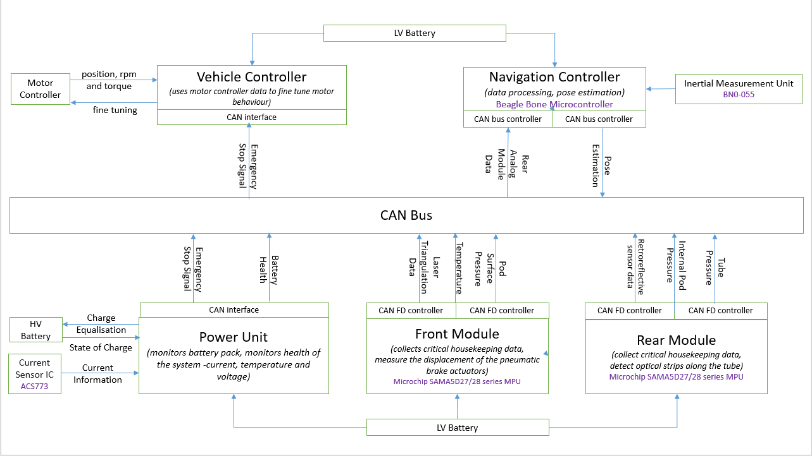

# Hyperloop India: Electronics Subsystem for a Hyperloop Pod
On board electronics, electrical and pose estimation subsystem for a hyperloop pod

## Electronics sub-system Architecture

## Publication
Paper: https://ieeexplore.ieee.org/document/9463430

Authors: Nihal Singh, Jay Karhade, Ishika Bhattacharya, Prathamesh Saraf, Plava Kattamuri, Prof. Alivelu Manga Parimi
